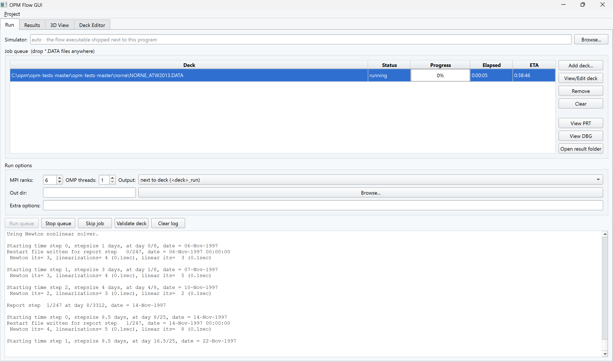
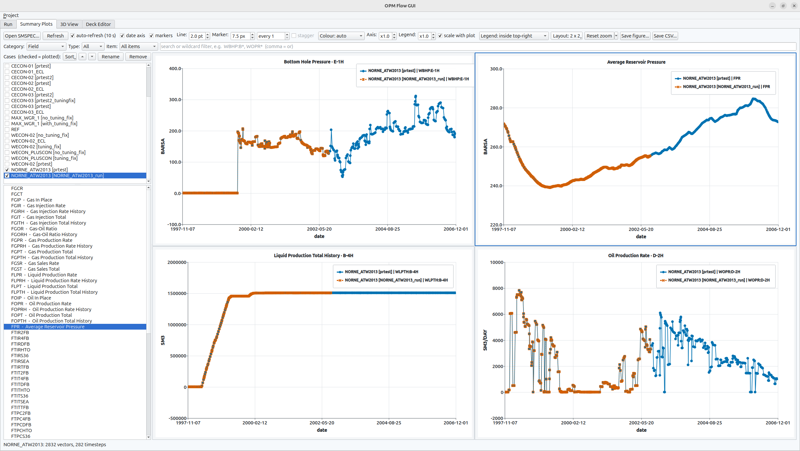
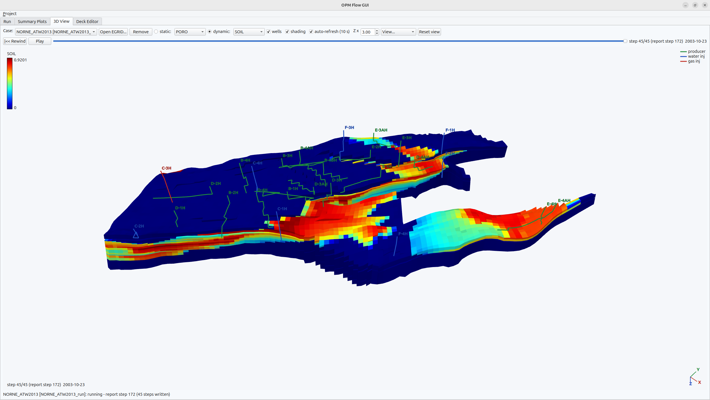
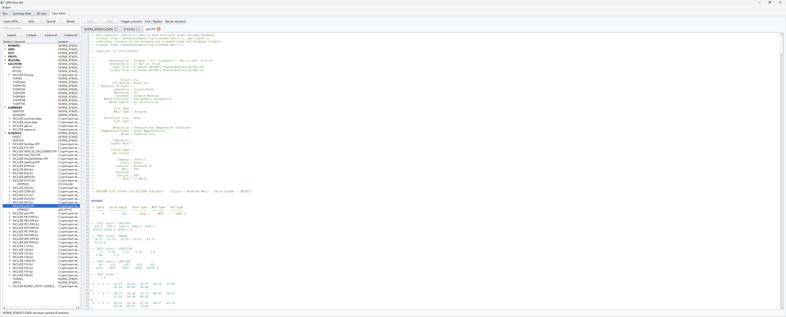

# flow-gui

A cross-platform (Windows / Linux / macOS) **Qt 6** graphical workbench for
[OPM Flow](https://opm-project.org): run and monitor simulations, plot summary
results, animate them in 3D, and edit decks — all in one window.

| Run queue | Results & case comparison |
|---|---|
|  |  |
| **3D viewer** | **Deck editor** |
|  |  |

## Features
- **Projects** — the *Project* menu saves/loads a `.opmproj` file (readable
  JSON) holding the whole working setup, so a study is one *Open* away
  (Ctrl+O/Ctrl+S; missing decks/cases are skipped with a note in the log):
  - the **deck queue**, including where each finished job wrote and how it
    ended, so *Open folder* and *View PRT* still reach its output;
  - the **run options** — MPI ranks / OMP threads, output policy and
    directory, TUNING, extra flow arguments, simulator override;
  - the **Summary Plots** tab — the cases with their checked state and which
    one is active, the category/type/item/wildcard filters, what each subplot
    shows, and how it is drawn (subplot layout, legend placement including a
    dragged one, line width, marker size and interval, date axis);
  - the **3D view**'s case, property and vertical exaggeration, the **deck
    editor**'s open files, and which tab was in front.
- **Sessions** — closing the GUI stores that same state (plus the window
  geometry), so starting it again simply continues where the last session
  stopped, project file or not. Loading it is lazy where it costs: the 3D
  grid is only read once that tab is looked at.
- **Job queue table** of `*.DATA` input decks (add / remove / clear,
  multi-select, **drag & drop** onto the window) with per-job **status,
  progress bar, elapsed time and ETA** parsed live from flow's
  `Report step X/N at day Y/Z` output, with **View/Edit deck** right below
  *Add deck*. Grouped separately below, for after the run finishes:
  **View PRT**, **View DBG**, and **Open result folder**. **Run selected**
  runs only the highlighted rows (Ctrl/Shift-click for several), leaving the
  rest of the queue untouched — handy to re-run one case of a study after
  editing its deck; *Run queue* runs everything.
- **Summary Plots tab** (when built with summary support): plot summary vectors
  (FOPR, WBHP, ...) straight from a run's `SMSPEC`/`UNSMRY` via opm-common's
  `EclIO::ESmry`. The **vector picker is grouped and filtered** — using
  opm-common's own `SummaryNode` classification it offers **Category**
  (Field / Well / Group / Region / Block / ... — only those present),
  **Type** (Rate / Total / Ratio / Pressure / ...), an **Item** dropdown
  (the wells / groups / region numbers that exist; block and connection cells
  are shown as grid `I,J,K` indices) and a text search, then a
  tree grouped by quantity with human-readable names (WOPR → "Oil Production
  Rate", ~130 mnemonics). Multi-select plots several curves, with a second
  Y axis when units differ (e.g. rate vs. pressure); 10 s auto-refresh
  updates the plot while a simulation is still writing, and the Summary Plots and
  3D tabs re-check their files when a job finishes and when the tab is
  shown (a case is registered as soon as its job starts, before flow has
  written anything). The search box also accepts comma-separated
  **wildcard filters** qsummary-style — `WBHP:B*, WOPR*` narrows the tree
  to the matching `KEYWORD:ITEM` keys (plain text still matches anywhere).
  **Subplots** — the *Layout* button opens a grid picker: hover the cells
  to choose **rows × columns**, up to **6 × 8**. A shape rather than a list,
  because a wide screen wants 2×5 or 3×6 and a preset list long enough to
  hold those is a list nobody reads. Each subplot keeps its own selection: click one to focus it — the focused
  one gets a blue frame — and the vector tree then shows and edits that
  subplot's curves; subplots are equally sized, and shrinking the layout
  keeps the focused one. **Ctrl+drag a subplot onto another to swap them**,
  which moves the vectors, the zoom and the legend position together — the
  order of a figure is a presentation decision. Charts are built as a
  layout asks for them, so a session that stays on one chart pays for one.
  How dense a grid is *useful* is a matter of screen: 2×2 is comfortable
  anywhere, 3×3 wants about 1920 px across, and 4×4 and beyond want a 4K
  panel or a wide one — on an ultrawide, few rows and many columns
  (2×6, 3×6) is usually the shape that fits — the axes thin their tick
  count to whatever the subplot can label rather than shrinking the labels
  or eliding them, so a dense grid stays readable as far as it can. Drag to
  zoom — a zoomed view survives refreshes until *Reset zoom*, which clears
  every subplot, or just the focused one from the arrow beside it — and
  refreshes also keep the tree's expansion and scroll position. Calendar
  dates on the X axis by default (untick *date axis* for days).
  The **legend** can be docked to any edge, floated in a corner *inside* the
  plot (on a translucent plate, above the curves), or hidden — and a
  floating legend can be **dragged** anywhere with the mouse, keeping its
  spot across refreshes and resizes (picking a placement again re-parks it).
  Curves are styled for print from a colourblind-safe palette, with round
  axis ticks. The **dash pattern always keys the case**, so a comparison
  survives greyscale; **colour follows whichever dimension carries the
  information** — comparing one vector across cases it separates the
  *cases*, otherwise it keys the *vector* (and the dash still tells the
  cases apart). *Save figure...* writes a **vector PDF**
  sized to the figure (7 in wide, no margins — drop it straight into
  `\includegraphics`) or a **300 dpi PNG** rendered at 3×, not grabbed off
  the screen; *Save CSV* exports the plotted curves of every checked case.
  Any external `SMSPEC` can be opened too.
- **3D View tab** (when built with opm-common): the corner-point grid
  rendered with a self-contained OpenGL widget (no external engine) —
  colored by any selectable static (INIT) or dynamic (UNRST) cell property,
  well trajectories from the restart well/connection arrays, report-step
  animation with play button and date display — **drag the step bar, or click
  anywhere on it, to jump straight to that report step** (the date is shown
  next to it and on the view; scrubbing switches to the dynamic property, so
  the bar always shows what it says it does) — vertical exaggeration,
  orbit/pan/zoom camera, and a color legend. The default view frames the
  model with its long horizontal axis across the screen (from a principal-
  axis analysis of the grid), seen from the side and slightly above. The
  orbit is **unrestricted** — keep dragging past the side view to get under
  the model and look at the base of the reservoir — and a *View* menu jumps
  to the Home / Top / Bottom / Side viewpoints, keeping the current zoom and
  pan (*Reset view* re-frames everything). Cases mirror the Summary Plots tab
  (or open any `.EGRID` directly), and *Remove* drops the selected one so the
  list does not just grow with every job of a long session — the run's files
  are left alone, and the view moves to the neighbouring case (or goes blank
  once the last one is gone). Removing a case in the Summary Plots tab drops
  it here too, the same way adding and renaming already carry over.
- **Deck Editor tab** — edit the deck and its INCLUDE files directly: a
  section tree (RUNSPEC ... SCHEDULE) lists every keyword with file and
  line, INCLUDEs expanded recursively; clicking opens the real file in a
  tabbed editor with Eclipse syntax highlighting and line numbers. The tree
  starts with every section **collapsed** — eight sections say more than
  the hundreds of keywords under them — and a section you open stays open
  across a rescan. It has a **keyword filter** (matches keyword or file
  name, hits expanded automatically), Expand/Collapse for the selected
  subtree and Expand all / Collapse all buttons; **Close all** shuts every
  open tab at once (following INCLUDEs leaves a row of them), asking once
  for the lot if any have unsaved changes; the editor a **find & replace bar**
  (the *Find / Replace* button, or Ctrl+F / Ctrl+H — Enter/F3 next,
  Shift+F3 previous, wrap-around, every match highlighted with a count;
  the *Replace...* toggle in the bar opens *Replace* and *Replace all*,
  the latter a single undo step). Searching is **case sensitive** by
  default — deck keywords are upper case — with a *match case* box to
  relax it. **Undo/Redo** buttons sit in the toolbar (Ctrl+Z / Ctrl+Y work
  as usual), and a **Toggle comment** button (Ctrl+/) comments the selected
  lines with `--`, or uncomments them when they already are comments.
  **INCLUDEs are followed**: double-click the *file name* — or right-click
  it for *Open "…"* — to open that file in its own tab. Only the name
  itself navigates (clicking the `INCLUDE` keyword does not), and only when
  it resolves to an existing file, so quoted text such as a well name is
  left alone.
  Saves
  go to the original files (never a flattened copy), so shared includes
  stay consistent; View/Edit deck on the Run tab jumps straight to a queued
  deck.
  Files edited **outside** the GUI are noticed: an unmodified tab reloads
  itself, one with unsaved edits is flagged `!` and left alone until you
  press *Reload*. Since flow re-reads the decks from disk on every run,
  *Run*/*Validate* offer to save pending editor changes first, so what runs
  is always what you last edited.
- **Simulator** — by default the `flow`(`.exe`) shipped next to the GUI (in a
  development checkout it falls back to the harness build tree); the resolved
  path is shown in the log at startup. `flow` contains every model variant,
  so end users never need to change it. For **developers** the *Simulator*
  box overrides this: point it at a freshly built executable to test your own
  build. It is a **list** — every build you browse to or type joins it, most
  recent first, so comparing a release against your own build is a pick from
  the drop-down rather than a path to retype; the first entry is the flow
  shipped with the GUI, i.e. no override. The choice and the list are
  remembered between sessions and stored in the project file.
- **Queue control** — *Stop queue* kills the running job and aborts the rest;
  *Skip job* kills the running job and continues with the next; *Validate
  deck* parse-and-initializes the selected deck (`flow --enable-dry-run`)
  without running the simulation. When every job has already run, *Run
  queue* offers to **re-run** the finished/failed jobs (after a
  confirmation, since their previous output is overwritten). The queue
  itself is remembered between sessions.
- **Case manager & comparison** — loaded cases appear in a checkable list:
  **checked cases are plotted together** (legend shows `case | vector`
  whenever more than one is checked, so a curve always says which run it is),
  the highlighted case drives the vector tree, and *Remove* drops a case from
  the list. A checked case that cannot be read is **named** in the status
  line and counted in the plot title (`2 of 3 checked cases`) rather than
  quietly missing, and a case that fails to load never leaves the previous
  one on screen under its name. Cases can be **renamed** (*Rename*, double-click or F2) — the
  new name is what the legend shows, so a comparison can read
  `Base case | FOPR` instead of a run directory name; names are kept unique
  and travel with the project file. A case keeps its plain name while that
  name is unique in the list; as soon as another run of the same deck is
  loaded, **every** one of them is tagged with the part of its path that
  tells them apart — the run directory, or as much of the path above it as
  it takes when those directories are named alike (they usually are: the
  default is `<deck>_run` for all of them). Full path in the tooltip. The
  tags are worked out over the whole list on every add, remove and rename,
  so removing a case lets the survivor go back to reading plainly, and a
  name you typed yourself is never tagged.
  The **order of the list is the order of the plot** — of the curves, their
  colours and dashes, the legend and the CSV columns — so it can be set:
  *Sort* by name (either way), plotted-first or back to the order loaded;
  the arrow buttons (or Ctrl+Up / Ctrl+Down) move one case at a time; or
  drag a case where you want it. The 3D tab's list follows. The list sits on
  a **splitter** above the vector tree, so it can be dragged open when there
  are more cases than fit, and that size is remembered.
  The *markers* toggle marks **every data point** in the summary
  — no sampling by default, so the markers are exactly the samples the run
  wrote — and **hovering a marker** shows its case, date and value with
  unit. With markers on, the **legend shows them too**: each entry's sample
  is the case's shape riding on its line, so an entry looks like the curve
  it stands for. Everything drawn on a chart — line width, marker size and
  the legend — **follows that chart's own size** by default, so a 2×2 layout
  is four readable plots rather than four heavy ones; *scale with plot* turns
  that off when a figure needs exactly the sizes set. The **Legend** box
  scales the legend on top of that (`x1.0` is the normal size), for a figure
  that wants it a size up or out of the way.
  **Line** and **Marker** spin boxes set the curve width and marker
  size, and *every n* thins the markers on a dense curve (1 = all, the
  default); thinning steps by whole data points, so a drawn marker is
  always a real `(time, value)` sample. A different **shape** per case and
  a **hollow** fill on every case after the first keep curves separable
  where markers coincide. Finished runs can be opened by dropping
  an `.SMSPEC` on the window (or *Open SMSPEC...*), and adding a deck whose
  `<deck>_run` output already exists registers its case automatically.
- **Completion notification** — a system-tray toast when the queue finishes
  (clicking it opens the finished case in the Summary Plots tab), and an
  oversubscription note in the log when ranks × threads exceed the machine's
  logical cores.
- **PRT viewer** with free-text search and a *Next problem* button cycling
  through Error/Warning lines; the log pane batches appends (100 ms) and
  only follows the tail while you are at the bottom.
- **Parallel runs** — MPI rank count (spawns `mpiexec -n N ...`) and
  `--threads-per-process` OpenMP threads; both default to 1 (serial).
- **Output directory policy** — per-deck `<deck>_run` next to the deck
  (default), or a custom directory used exactly as given (the directory
  chooser has a *New Folder* button on every platform; the path is created
  if needed).
- **TUNING** checkbox — `--enable-tuning`, off by default (flow's own
  default): honor the deck's `TUNING` keyword for schedule-controlled
  time-stepping instead of ignoring it; remembered between sessions and
  stored in the project file, like the other run options.
- **Extra options** passed through to flow verbatim
  (e.g. `--linear-solver=ilu0`).
- **Live log** — merged stdout/stderr streams into the window while running.
- **Stop job** — kills the entire process tree (Windows: `taskkill /T`;
  Linux/macOS: the child leads a process group that is signalled as a whole).
- **Persistent settings** — the run options (simulator and the builds it
  lists, ranks/threads, output policy, extra options), the queue with each
  job's outcome, the plot and 3D setup, the deck editor's open files, the
  front tab and the window geometry are all remembered between sessions
  (QSettings; the tab state is stored as the same JSON the project file
  uses). **File dialogs** are too: each kind (decks, SMSPEC, figures, CSV,
  grids, projects, output directories) reopens where you left it, unless the
  field it belongs to already points somewhere — the folder of the case, deck
  or project in hand wins over the last one used.

## Building

### Windows (this harness)
Use the official **prebuilt** Qt (signed binaries; fast, and it avoids a
known pitfall: building Qt from source executes its own freshly built
`moc`/`rcc` tools, which Windows Smart App Control blocks on machines where
it is enforced — the same applies to vcpkg's `qtbase` port):
```powershell
winget install -e --id Python.Python.3.12
python -m pip install aqtinstall
python -m aqt install-qt windows desktop 6.8.3 win64_msvc2022_64 -m qtcharts --archives qtbase qtcharts -O C:\Qt

. .\setup-env.ps1
cmake -S flow-gui -B build-gui -G Ninja -DCMAKE_BUILD_TYPE=Release `
      -DCMAKE_PREFIX_PATH=C:\Qt\6.8.3\msvc2022_64
cmake --build build-gui
C:\Qt\6.8.3\msvc2022_64\bin\windeployqt --release --no-translations build-gui\flow-gui.exe
build-gui\flow-gui.exe
```
`windeployqt` copies the required Qt DLLs and the platform plugin next to
the executable.

**Summary plotting** is enabled automatically when the harness'
`install-mpi` (opm-common with `EclIO::ESmry`) and Qt Charts are found at
configure time — watch for `flow-gui summary plotting: ON`. Build from a
`setup-env.ps1` shell (the opm-common linkage needs the MSVC/MS-MPI env);
the needed runtime DLLs (`fmt.dll`, `libomp140.x86_64.dll`) are copied next
to the exe automatically. On Linux point `-DFLOWGUI_OPM_PREFIX` at an
opm-common install prefix and install `qt6-charts-dev` (or equivalent).

### Linux
Basic build (Run tab + Deck Editor only):
```bash
sudo apt install qt6-base-dev            # or: dnf install qt6-qtbase-devel
cmake -S flow-gui -B build-gui -DCMAKE_BUILD_TYPE=Release
cmake --build build-gui
./build-gui/flow-gui
```

Full build (adds the Summary Plots and 3D View tabs) — needs Qt Charts and an
opm-common **install prefix**; validated on Ubuntu 24.04:
```bash
sudo apt install qt6-base-dev qt6-charts-dev libfmt-dev libboost-dev \
                 libblas-dev liblapack-dev cmake ninja-build g++

# 1) build & install opm-common (any recent checkout) into the harness
cmake -S <opm-common checkout> -B build-opmcommon-linux -G Ninja \
      -DCMAKE_BUILD_TYPE=Release -DBUILD_TESTING=OFF -DOPM_ENABLE_PYTHON=OFF \
      -DCMAKE_INSTALL_PREFIX=$PWD/install-linux
cmake --build build-opmcommon-linux
cmake --install build-opmcommon-linux

# 2) flow-gui against it
cmake -S flow-gui -B build-gui-linux -G Ninja -DCMAKE_BUILD_TYPE=Release \
      -DFLOWGUI_OPM_PREFIX=$PWD/install-linux
cmake --build build-gui-linux
./build-gui-linux/flow-gui
```
Watch for `flow-gui summary plotting: ON` and `flow-gui 3D viewer: ON` in the
configure output. On Linux there is no bundled `flow` next to the GUI — point
the *Simulator* field at your own build
(e.g. `.../build/opm-simulators/bin/flow`).

### macOS
```bash
brew install qt
cmake -S flow-gui -B build-gui -DCMAKE_BUILD_TYPE=Release \
      -DCMAKE_PREFIX_PATH="$(brew --prefix qt)"
cmake --build build-gui
open build-gui/flow-gui.app
```

## Usage
1. **Add deck...** one or more `*.DATA` files to the queue. On Windows the
   simulator is the `flow.exe` shipped with the GUI (see the log's first
   lines); on Linux/macOS nothing is bundled — set the **Simulator** field
   to your own build (e.g. `.../build/opm-simulators/bin/flow`) once, it is
   remembered between sessions.
2. Choose **MPI ranks** / **OMP threads** (1/1 = serial), output policy and
   any extra flow options.
3. **Run queue** — jobs run one after another; the log streams live.
4. **Stop job** kills the currently running job and aborts the remainder of
   the queue.

`flow-gui --version` prints the version and exits (headless smoke test).

## Extending
The application is deliberately event-driven (a `QProcess` job runner — no
worker threads) and split into one widget per tab. Natural next steps:
- per-deck run options (per-job ranks/threads/arguments),
- RFT / aquifer output support in the Summary Plots tab,
- deck editor: keyword templates and context help (OPM manual links).

## Notes
- For MPI runs, `mpiexec` must be on `PATH` (on Windows it is after
  installing MS-MPI; run from a `setup-env.ps1` shell or add
  `C:\Program Files\Microsoft MPI\Bin` to `PATH`).
- On Ubuntu, `mpiexec` comes with `sudo apt install openmpi-bin` (pulled in
  automatically by `libopenmpi-dev` when building opm-simulators). It must
  be the same MPI flavor the simulator was built against — the distro
  default Open MPI on both sides is the safe choice.
- On Windows, remember the firewall pre-authorization for freshly built
  simulators (`allow-firewall.ps1`, see the harness README).

## License
Copyright (C) 2026 SINTEF Digital, Mathematics & Cybernetics. flow-gui is free software under the
GNU General Public License, version 3 or later — see the repository
[LICENSE](../LICENSE).
